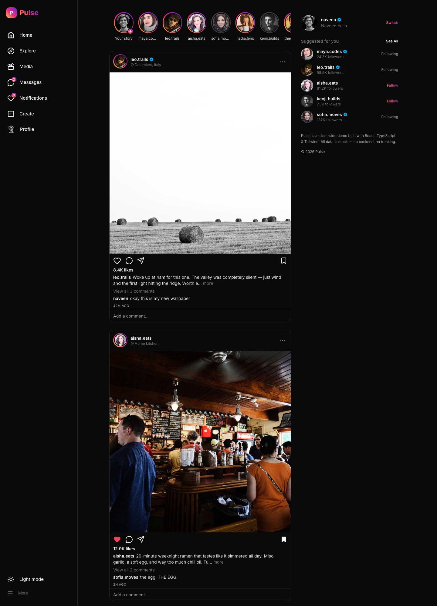
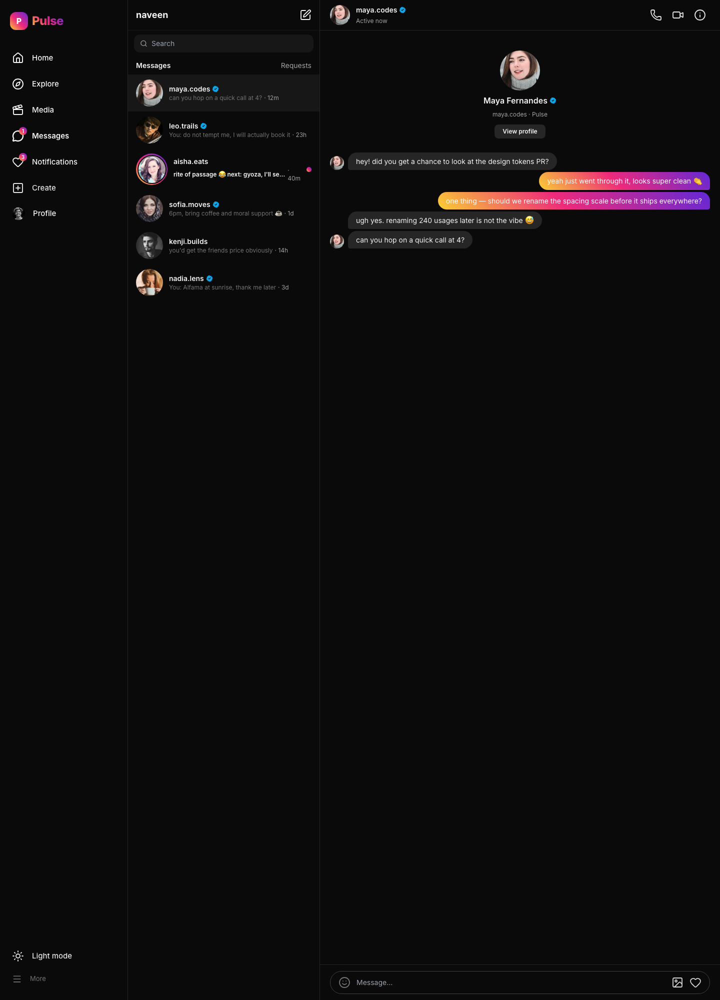
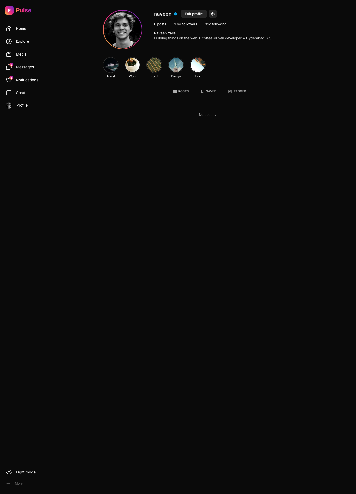
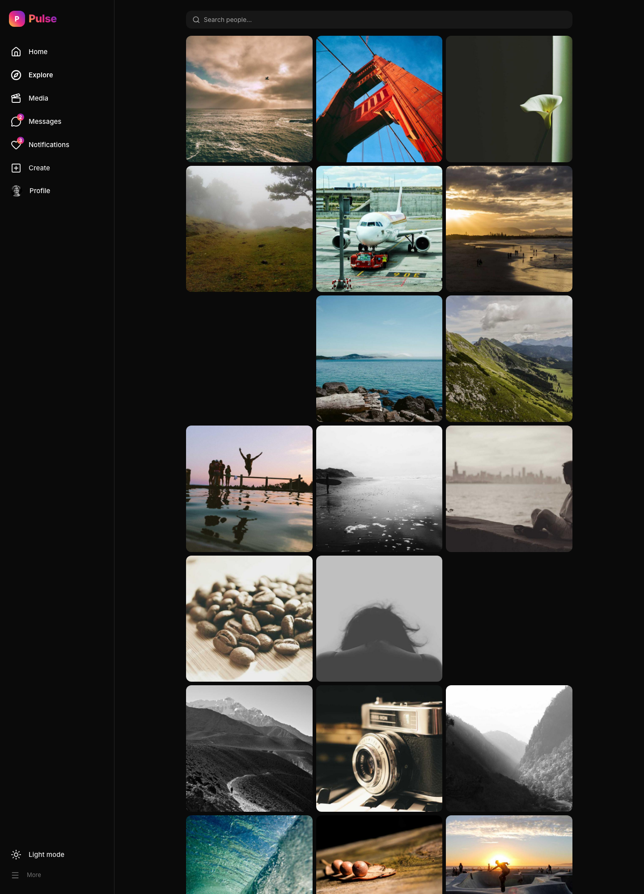
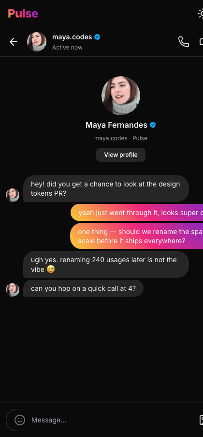

# 💬 Pulse Social

A modern social media web app — feed, stories, posting, profiles, and
real-time-style chat/messaging. Built with React, TypeScript, and Tailwind CSS.

Runs fully client-side with rich mock data — **no backend or configuration
required.**

## Screenshots

| Feed | Messages / Chat |
| --- | --- |
|  |  |

| Profile | Explore |
| --- | --- |
|  |  |

| Chat (mobile) |
| --- |
|  |

## Features

- **Feed** — image posts with like (heart toggle + double-tap animation),
  comment, save/bookmark, captions, and timestamps; optimistic UI
- **Stories** — a story bar with gradient rings and a full-screen story viewer
  with auto-advancing progress bars
- **Create post** — add a post (image + caption) that prepends to the feed
- **Comments** — per-post threads with the ability to add a comment
- **Explore / Search** — media grid and user search
- **Profiles** — header with stats (posts / followers / following), bio, and a post grid
- **Messages / Chat** — a DM interface with a conversation list, message bubbles,
  a typing indicator, and a composer that appends your message and simulates a
  reply so it feels real-time
- **Notifications** — likes, follows, and comments
- Polished light/dark UI, fully responsive with a mobile bottom-tab layout

## Tech stack

- React 18 + TypeScript
- Vite
- Tailwind CSS
- React Router
- lucide-react (icons)

## Getting started

```bash
npm install
npm run dev      # start the dev server
npm run build    # production build
```

Everything runs client-side with mock data — no environment variables needed.

## License

MIT
